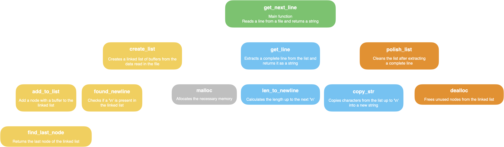
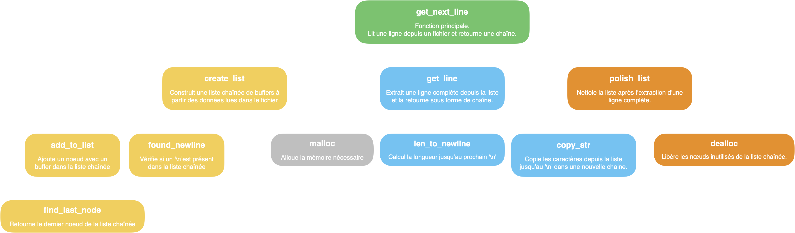

<p align="left">
  <a href="#--------get_next_line--">🇬🇧 English</a> |
  <a href="#--------get_next_line---1">🇫🇷 Français</a>
</p>

<h1 align="center">
  <br>
  
  <br>
  get_next_line
  <br>
</h1>

<h4 align="center"><em>Develop a C program that allows reading a line from a file descriptor.</em></h4>

<p align="center">
  
  
  
</p>

<p align="center">
  <a href="https://drive.google.com/file/d/18-0lOgAOgK1PMqEwRl_qFN4oFcd7TqWD/view?usp=sharing">Subject</a> |
  <a href="#-features">Features</a> •
  <a href="#-description">Description</a> •
  <a href="#%EF%B8%8F-compilation">Compilation</a>
</p>

---

## 📌 Features

### ✅ Mandatory part
- Reads a file descriptor line by line.
- Returns a complete line, including the `\n` character when present.
- Properly handles end-of-file and error cases.

### 🚀 Bonus part
- Supports multiple open file descriptors simultaneously.
- Independent memory management for each file descriptor.

---

## 📝 Description



### 🔹 **`get_next_line`**
- **Role**: Main function. Reads a line from a file and manages the remaining data using a static variable.
- **Function**:
  - Checks for initial errors (invalid descriptor, incorrect buffer size, etc.).
  - Calls `create_list` to fill data from file.
  - Uses `get_line` to extract a complete line.
  - Cleans memory with `polish_list`.
- **Relations** :
  - Depends on `create_list`, `get_line`, and `polish_list` to accomplish its tasks.

---

### 🔹 **`create_list`**
- **Role**: Fills a chained list with data read from the file.
- **Function**:
  - Reads data with `read` and stores it in a buffer.
  - Adds the buffer as a node in the linked list.
  - Stops when the `\n` character is found or when the end of the file is reached.
- **Relations** :
  - Uses `add_to_list` to add nodes to the list.
  - Detects the end of a line using `found_newline`.

---

### 🔹 **`add_to_list`**
- **Role**: Adds a new node to the linked list.
- **Function**:
  - Allocates a new node.
  - Links this node to the last element of the existing list.
- **Relations**:
  - Works in conjunction with `find_last_node` to locate the last node.

---

### 🔹 **`found_newline`**
- **Role**: Checks whether a ``newline`` character is present in the linked list.
- **Function**:
  - Scans each node and returns `1` as soon as a `\n` is found.
  - Otherwise, returns `0`.

---

### 🔹 **`get_line`**
- **Role**: Extracts a complete line from the linked list.
- **Function**:
  - Uses `len_to_newline` to calculate the size of the line to be extracted.
  - Allocates a string and copies characters with `copy_str`.
- **Relations** :
  - Depends on `len_to_newline` and `copy_str` to build the line.

---

### 🔹 **`len_to_newline`**
- **Role**: Calculates the length up to the character `len`.
- **Function** :
  - Scans the linked list and counts the characters up to `\n`.

---

### 🔹 **`copy_str`**
- **Role**: Copies characters up to `\n` from the linked list to a new string.
- **Function**:
  - Iterates over each node and copies characters one by one.
  - Adds `\0` to end the string.

---

### 🔹 **`polish_list`**
- **Role**: Cleans up the list after a line has been extracted.
- **Function**:
  - Keeps remaining data after `\n` in a new node.
  - Deletes old nodes with `dealloc`.

---

### 🔹 **`dealloc`**
- **Role**: Frees memory for unused nodes.
- **Function**:
  - Scans each node and frees its memory.
  - Keeps a new node clean if data remains after `\n`.

---

## ⚙️ Compilation

### 🔧 Compilation
- **Mandatory part**:
  ```bash
  cc -Wall -Wextra -Werror -D BUFFER_SIZE=42 get_next_line.c get_next_line_utils.c
- **Bonus part** :
  ```bash
  cc -Wall -Wextra -Werror -D BUFFER_SIZE=42 get_next_line_bonus.c get_next_line_utils_bonus.c

---

<h1 align="center">
  <br>
  
  <br>
  get_next_line
  <br>
</h1>

<h4 align="center"><em>Développer un programme en C, qui permet de lire une ligne depuis un descripteur de fichier (fd).</em></h4>

<p align="center">
  
  
  
</p>

<p align="center">
  <a href="https://drive.google.com/file/d/1F2Jj6-kd38BcBH44xoLMvPZU7OinABiX/view?usp=sharing">Sujet</a> |
  <a href="#-fonctionnalit%C3%A9s">Fonctionnalités</a> •
  <a href="#-description-1">Description</a> •
  <a href="#%EF%B8%8F-compilation-1">Compilation</a>
</p>

---

## 📌 **Fonctionnalités**

### ✅ Partie obligatoire
- Lecture ligne par ligne depuis un fichier ou l'entrée standard.
- Retourne une ligne complète, y compris le caractère `\n` lorsqu'il est présent.
- Gère correctement les fins de fichier et les cas d'erreurs.

### 🚀 Partie Bonus
- Prise en charge de plusieurs descripteurs de fichier ouverts simultanément.
- Gestion indépendante des données pour chaque descripteur.

---

## 📝 **Description**



### 🔹 **`get_next_line`**
- **Rôle** : Fonction principale. Lit une ligne depuis un fichier et gère les données restantes grâce à une variable statique.
- **Fonctionnement** :
  - Vérifie les erreurs initiales (descripteur invalide, taille de buffer incorrecte, etc.).
  - Appelle `create_list` pour remplir les données à partir du fichier.
  - Utilise `get_line` pour extraire une ligne complète.
  - Nettoie la mémoire avec `polish_list`.
- **Relations** :
  - Dépend de `create_list`, `get_line`, et `polish_list` pour accomplir ses tâches.

---

### 🔹 **`create_list`**
- **Rôle** : Remplit une liste chaînée avec les données lues à partir du fichier.
- **Fonctionnement** :
  - Lit les données avec `read` et les stocke dans un buffer.
  - Ajoute le buffer comme un nœud dans la liste chaînée.
  - S'arrête lorsque le caractère `\n` est trouvé ou lorsque la fin du fichier est atteinte.
- **Relations** :
  - Utilise `add_to_list` pour ajouter des nœuds à la liste.
  - Détecte la fin d'une ligne grâce à `found_newline`.

---

### 🔹 **`add_to_list`**
- **Rôle** : Ajoute un nouveau nœud à la liste chaînée.
- **Fonctionnement** :
  - Alloue un nouveau nœud.
  - Lie ce nœud au dernier élément de la liste existante.
- **Relations** :
  - Travaille conjointement avec `find_last_node` pour localiser le dernier nœud.

---

### 🔹 **`found_newline`**
- **Rôle** : Vérifie si un caractère `\n` est présent dans la liste chaînée.
- **Fonctionnement** :
  - Parcourt chaque nœud et retourne `1` dès qu'un `\n` est trouvé.
  - Sinon, retourne `0`.

---

### 🔹 **`get_line`**
- **Rôle** : Extrait une ligne complète depuis la liste chaînée.
- **Fonctionnement** :
  - Utilise `len_to_newline` pour calculer la taille de la ligne à extraire.
  - Alloue une chaîne et copie les caractères avec `copy_str`.
- **Relations** :
  - Dépend de `len_to_newline` et `copy_str` pour construire la ligne.

---

### 🔹 **`len_to_newline`**
- **Rôle** : Calcule la longueur jusqu'au caractère `\n`.
- **Fonctionnement** :
  - Parcourt la liste chaînée et compte les caractères jusqu'à `\n`.

---

### 🔹 **`copy_str`**
- **Rôle** : Copie les caractères jusqu'à `\n` depuis la liste chaînée vers une nouvelle chaîne.
- **Fonctionnement** :
  - Itère sur chaque nœud et copie les caractères un par un.
  - Ajoute `\0` pour terminer la chaîne.

---

### 🔹 **`polish_list`**
- **Rôle** : Nettoie la liste après l'extraction d'une ligne.
- **Fonctionnement** :
  - Garde les données restantes après `\n` dans un nouveau nœud.
  - Supprime les anciens nœuds avec `dealloc`.

---

### 🔹 **`dealloc`**
- **Rôle** : Libère la mémoire des nœuds inutilisés.
- **Fonctionnement** :
  - Parcourt chaque nœud et libère sa mémoire.
  - Conserve un nouveau nœud propre si des données restent après `\n`.

---

## ⚙️ **Compilation**

- **Partie obligatoire** :
  ```bash
  cc -Wall -Wextra -Werror -D BUFFER_SIZE=42 get_next_line.c get_next_line_utils.c
- **Partie bonus** :
  ```bash
  cc -Wall -Wextra -Werror -D BUFFER_SIZE=42 get_next_line_bonus.c get_next_line_utils_bonus.c
