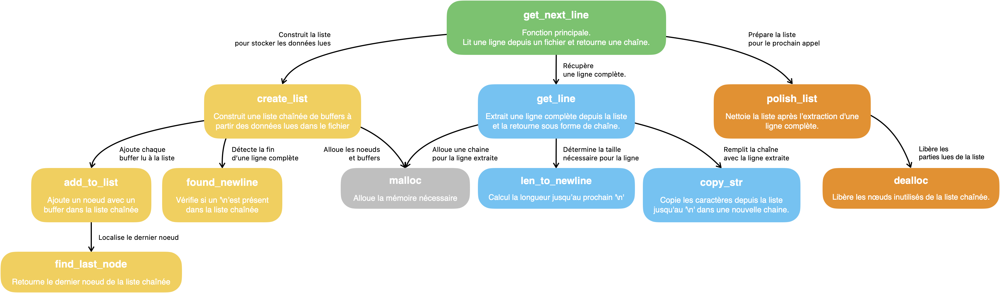

# **get_next_line**

Ce projet a pour objectif de développer une fonction en C, `get_next_line`, qui permet de lire une ligne depuis un descripteur de fichier (fd).

---

## **Fonctionnalités**

### Partie Obligatoire
- Lecture ligne par ligne depuis un fichier ou l'entrée standard.
- Retourne une ligne complète, y compris le caractère `\n` lorsqu'il est présent.
- Gère correctement les fins de fichier et les cas d'erreurs.

### Partie Bonus
- Prise en charge de plusieurs descripteurs de fichier ouverts simultanément.
- Gestion indépendante des données pour chaque descripteur.

---

## **Description des fonctions**



### **get_next_line**
- **Rôle** : Fonction principale. Lit une ligne depuis un fichier et gère les données restantes grâce à une variable statique.
- **Fonctionnement** :
  1. Vérifie les erreurs initiales (descripteur invalide, taille de buffer incorrecte, etc.).
  2. Appelle `create_list` pour remplir les données à partir du fichier.
  3. Utilise `get_line` pour extraire une ligne complète.
  4. Nettoie la mémoire avec `polish_list`.
- **Relations** :
  - Dépend de `create_list`, `get_line`, et `polish_list` pour accomplir ses tâches.

---

### **create_list**
- **Rôle** : Remplit une liste chaînée avec les données lues à partir du fichier.
- **Fonctionnement** :
  1. Lit les données avec `read` et les stocke dans un buffer.
  2. Ajoute le buffer comme un nœud dans la liste chaînée.
  3. S'arrête lorsque le caractère `\n` est trouvé ou lorsque la fin du fichier est atteinte.
- **Relations** :
  - Utilise `add_to_list` pour ajouter des nœuds à la liste.
  - Détecte la fin d'une ligne grâce à `found_newline`.

---

### **add_to_list**
- **Rôle** : Ajoute un nouveau nœud à la liste chaînée.
- **Fonctionnement** :
  1. Alloue un nouveau nœud.
  2. Lie ce nœud au dernier élément de la liste existante.
- **Relations** :
  - Travaille conjointement avec `find_last_node` pour localiser le dernier nœud.

---

### **found_newline**
- **Rôle** : Vérifie si un caractère `\n` est présent dans la liste chaînée.
- **Fonctionnement** :
  - Parcourt chaque nœud et retourne `1` dès qu'un `\n` est trouvé.
  - Sinon, retourne `0`.

---

### **get_line**
- **Rôle** : Extrait une ligne complète depuis la liste chaînée.
- **Fonctionnement** :
  1. Utilise `len_to_newline` pour calculer la taille de la ligne à extraire.
  2. Alloue une chaîne et copie les caractères avec `copy_str`.
- **Relations** :
  - Dépend de `len_to_newline` et `copy_str` pour construire la ligne.

---

### **len_to_newline**
- **Rôle** : Calcule la longueur jusqu'au caractère `\n`.
- **Fonctionnement** :
  - Parcourt la liste chaînée et compte les caractères jusqu'à `\n`.

---

### **copy_str**
- **Rôle** : Copie les caractères jusqu'à `\n` depuis la liste chaînée vers une nouvelle chaîne.
- **Fonctionnement** :
  - Itère sur chaque nœud et copie les caractères un par un.
  - Ajoute `\0` pour terminer la chaîne.

---

### **polish_list**
- **Rôle** : Nettoie la liste après l'extraction d'une ligne.
- **Fonctionnement** :
  1. Garde les données restantes après `\n` dans un nouveau nœud.
  2. Supprime les anciens nœuds avec `dealloc`.

---

### **dealloc**
- **Rôle** : Libère la mémoire des nœuds inutilisés.
- **Fonctionnement** :
  - Parcourt chaque nœud et libère sa mémoire.
  - Conserve un nouveau nœud propre si des données restent après `\n`.

---

## **Compiler et tester le projet**

### Compilation
- **Partie Obligatoire** :
  ```bash
  cc -Wall -Wextra -Werror -D BUFFER_SIZE=42 get_next_line.c get_next_line_utils.c
- **Partie Bonus** :
  ```bash
  cc -Wall -Wextra -Werror -D BUFFER_SIZE=42 get_next_line_bonus.c get_next_line_utils_bonus.c
